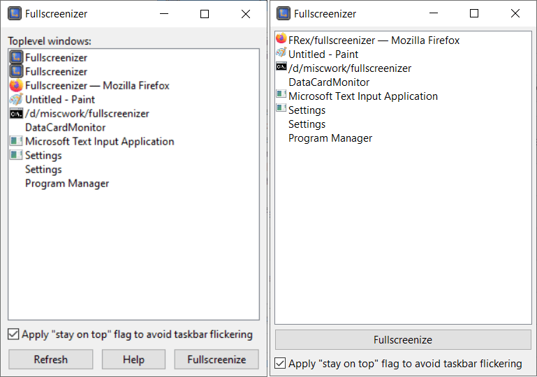

This is my personal modified version of [Fullscreenizer by Runtime Terror](http://runtimeterror.com/tools/fullscreenizer/).

As explained on that website, the original project doesn't take in patches, but welcomes people to fork the project so I did.

Changes I've made based on my own personal usage are:
1. fullscreenize the window on the monitor it's currenlty on, not on the primary one.
1. auto-refresh the window list every 500 milliseconds.
1. persist the chosen list box item between refreshes.
1. disable the "Fullscreenize" button when there is no window selected instead of showing a modal pop up message.
1. do not show Fullscreenizer's own window in the window list since I never want to fullscreenize them.
1. remove the "Toplevel windows:" label and the "Refresh" button.
1. remove the "Help" button since I find it pointless since in a single purpose program.
1. make the "Fullscreenize" button full width of the window since other two buttons ("Help" and "Refresh") were removed.
1. reduce the borders around the list box a bit.

